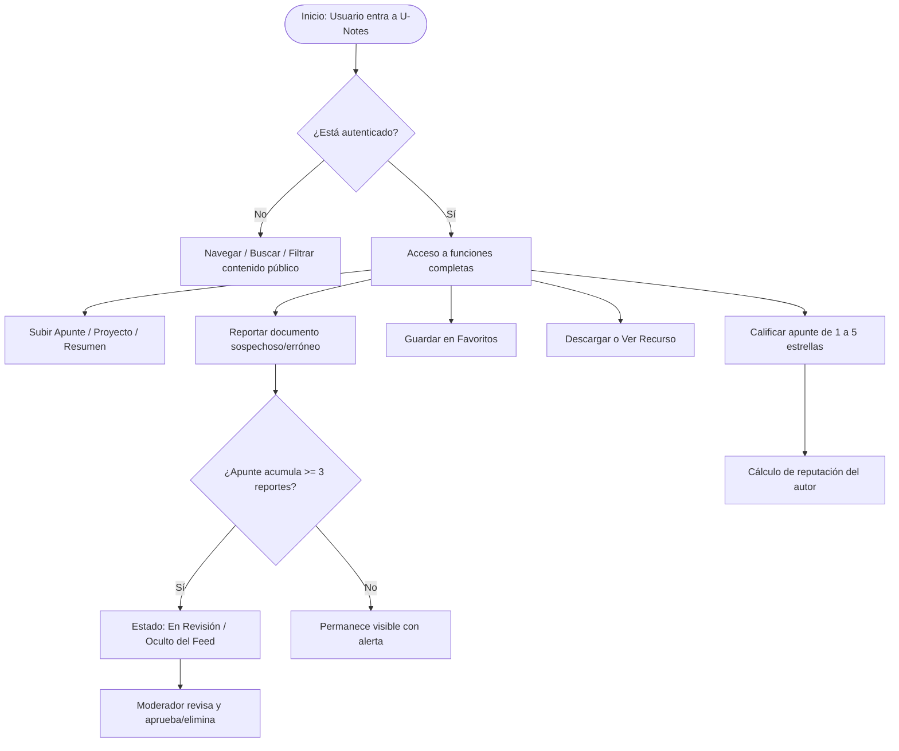

# 🎓 U-Notes — Plataforma de Apuntes Compartidos Universitarios

<div align="center">

[](https://github.com/)
[](https://github.com/)
[-brightgreen?style=for-the-badge&logo=diagramsdotnet)](https://github.com/)
[](https://github.com/)
[](https://github.com/)

<br/>

**Un ecosistema académico colaborativo diseñado para centralizar, compartir, calificar y moderar material de estudio universitario de forma ágil, categorizada y segura.**

[Explorar Documentación](#-estructura-detallada-del-repositorio) • [Ver Prototipo](#-prototipo-de-la-interfaz) • [Requerimientos](#-especificación-de-requerimientos) • [Diagramas y Modelos](#-diagramas-y-modelado-del-sistema)

</div>

---

## 📌 Tabla de Contenidos

- [💡 Acerca del Proyecto](#-acerca-del-proyecto)
  - [¿Qué es U-Notes?](#qué-es-u-notes)
  - [Problema que Resuelve](#problema-que-resuelve)
  - [Objetivos Principales](#objetivos-principales)
- [⚙️ ¿Cómo Funciona U-Notes?](#️-cómo-funciona-u-notes)
  - [Flujo de Usuario (Estudiante)](#1-flujo-del-estudiante-lector--contribuidor)
  - [Flujo de Moderación](#2-flujo-del-moderador)
  - [Mecanismo de Gamificación y Reputación](#3-sistema-de-reputación-y-gamificación)
- [🏗️ Arquitectura y Modelo Conceptual](#️-arquitectura-y-modelo-conceptual)
- [📋 Especificación de Requerimientos](#-especificación-de-requerimientos)
  - [Requerimientos Funcionales (RF)](#requerimientos-funcionales-rf)
  - [Requerimientos No Funcionales (RNF)](#requerimientos-no-funcionales-rnf)
- [📂 Estructura Detallada del Repositorio](#-estructura-detallada-del-repositorio)
  - [Explicación de Cada Directorio y Archivo](#explicación-de-cada-directorio-y-archivo)
- [📊 Diagramas y Modelado del Sistema](#-diagramas-y-modelado-del-sistema)
- [💻 Prototipo de la Interfaz](#-prototipo-de-la-interfaz)
  - [Características del Prototipo](#características-del-prototipo)
  - [Cómo Ejecutar el Prototipo](#cómo-ejecutar-el-prototipo-en-local)
- [🛠️ Tecnologías y Estándares](#️-tecnologías-y-estándares)
- [👥 Roles del Sistema](#-roles-del-sistema)
- [📄 Licencia y Créditos](#-licencia-y-créditos)

---

## 💡 Acerca del Proyecto

### ¿Qué es U-Notes?
**U-Notes** es una plataforma web colaborativa orientada a la comunidad universitaria, especialmente diseñada para estudiantes y docentes de facultades de ingeniería y ciencias. Permite el intercambio ordenado de recursos de aprendizaje: **apuntes de clase, proyectos de código, simulaciones, resúmenes, talleres y parciales de semestres anteriores**.

El proyecto surge dentro de la materia **Fundamentos de Ingeniería de Software (FIS)**, integrando un ciclo de ingeniería de software riguroso: desde la concepción del problema, especificación formal de requerimientos (ERS), metodologías ágiles, diseño de casos de uso, modelado UML estructural y dinámico, diseño de bases de datos relacionales, hasta la construcción de un prototipo frontend responsivo y accesible.

### Problema que Resuelve
1. **Dispersión de la Información:** El material de estudio suele quedar fragmentado en chats informales, carpetas personales o enlaces temporales que se pierden con el cambio de semestre.
2. **Falta de Validación y Calidad:** No existen mecanismos claros para saber si un apunte es confiable, actualizado o si contiene errores conceptuales.
3. **Dificultad de Búsqueda y Filtrado:** Los repositorios genéricos no están adaptados a la jerarquía académica universitaria (Facultad $\rightarrow$ Proyecto Curricular $\rightarrow$ Semestre $\rightarrow$ Materia $\rightarrow$ Tipo de Recurso).

### Objetivos Principales
- 🎯 **Centralizar** el conocimiento universitario en un único repositorio accesible e intuitivo.
- ⭐ **Garantizar la calidad** mediante un sistema de valoración de 1 a 5 estrellas y comentarios de la comunidad.
- 🛡️ **Proteger el ecosistema** mediante herramientas de reporte y moderación comunitaria preventiva.
- 🏆 **Incentivar la colaboración** reconociendo a los mejores aportantes mediante niveles de reputación.

---

## ⚙️ ¿Cómo Funciona U-Notes?



### 1. Flujo del Estudiante (Lector / Contribuidor)
1. **Exploración y Búsqueda Inteligente:** El estudiante puede buscar por palabras clave o usar la barra lateral de filtros multinivel para encontrar material exacto por facultad (ej. *Facultad de Ingeniería*), proyecto curricular (ej. *Ingeniería de Sistemas*), semestre (del 1 al 10) y tipo de material (*Proyectos y Código, Resúmenes, Talleres, Parciales Anteriores*).
2. **Consulta y Descarga:** Cada tarjeta de apunte muestra el autor, la materia, el semestre, la calificación promedio, el número de votos y botones directos para **Descargar PDF** o **Ver Repositorio Externo**.
3. **Aporte de Material:** Los estudiantes pueden publicar recursos indicando título, descripción, metadatos académicos y el archivo (PDF o enlace a repositorio de código).
4. **Interacción y Colección:** Posibilidad de guardar apuntes en la sección personal de "Guardados para después" y emitir valoraciones.

### 2. Flujo del Moderador
1. **Revisión de Alertas:** Supervisa publicaciones que han sido señaladas por la comunidad.
2. **Umbral de Seguridad Automático:** Si un recurso acumula **3 reportes**, el sistema lo cambia automáticamente al estado `"En Revisión"`, retirándolo inmediatamente del feed público para prevenir desinformación o infracciones.
3. **Resolución:** El moderador valida el reporte y decide si restaurar el material, solicitar correcciones o eliminarlo definitivamente.

### 3. Sistema de Reputación y Gamificación
- Los autores ganan puntos de reputación y reconocimientos en su perfil por cada valoración positiva ($\ge 4$ estrellas) recibida en sus aportes.
- Se implementan reglas de negocio estrictas: **un usuario no puede auto-calificar su propio material**.

---

## 🏗️ Arquitectura y Modelo Conceptual

U-Notes implementa el patrón de **Arquitectura por Capas (N-Tier Architecture)** para asegurar alta cohesión, bajo acoplamiento y facilidad de mantenimiento:

```
┌────────────────────────────────────────────────────────┐
│            CAPA DE PRESENTACIÓN (Frontend)            │
│  - Interfaz Web Responsiva (HTML5 / CSS3 / Vanilla JS) │
│  - Dashboard de Apuntes, Filtros Dinámicos, Perfil     │
└───────────────────────────┬────────────────────────────┘
                            │ REST API / JSON
┌───────────────────────────▼────────────────────────────┐
│         CAPA DE LÓGICA DE NEGOCIO (Backend)            │
│  - Controladores de Autenticación y Autorización (JWT) │
│  - Servicio de Búsqueda y Filtrado                     │
│  - Gestor de Valoraciones, Reputación y Gamificación   │
│  - Motor de Moderación y Reglas de Reportes            │
└───────────────────────────┬────────────────────────────┘
                            │ ORM / Prepared Statements
┌───────────────────────────▼────────────────────────────┐
│            CAPA DE ACCESO A DATOS (Persistencia)       │
│  - Base de Datos Relacional SQL (Entidad-Relación)     │
│  - Almacenamiento de Archivos (Filesystem / S3 Storage)│
└────────────────────────────────────────────────────────┘
```

---

## 📋 Especificación de Requerimientos

El sistema se diseñó bajo el documento formal de **Especificación de Requisitos de Software (ERS)**:

### Requerimientos Funcionales (RF)
| Código | Requerimiento | Descripción |
| :--- | :--- | :--- |
| **RF-01** | **Gestión de Usuarios y Autenticación** | Registro e inicio de sesión seguro con correo electrónico y contraseña encriptada. |
| **RF-02** | **Roles y Permisos** | Manejo de roles diferenciados: *Estudiante* (lector/contribuidor) y *Moderador* (control de calidad y etiquetas). |
| **RF-03** | **Publicación de Material** | Carga de apuntes con metadatos: Título, Descripción, Facultad, Carrera, Semestre, Materia y Recurso (PDF/URL). |
| **RF-04** | **Motor de Búsqueda y Filtrado** | Búsqueda por texto libre y filtros combinados por semestre, materia, facultad y tipo de documento. |
| **RF-05** | **Sistema de Valoración (Rating)** | Calificación de 1 a 5 estrellas entre pares. Regla: prohibida la auto-calificación. |
| **RF-06** | **Gestión de Favoritos** | Colección personal "Guardados para después" accesible desde el perfil de usuario. |
| **RF-07** | **Moderación y Reportes** | Reporte de publicaciones. Al alcanzar 3 reportes, el apunte pasa automáticamente a *"En Revisión"* y se oculta del feed. |
| **RF-08** | **Sistema de Reputación** | Puntuación visible en el perfil acumulada a partir de las calificaciones positivas recibidas. |

### Requerimientos No Funcionales (RNF)
| Código | Atributo de Calidad | Especificación Técnica |
| :--- | :--- | :--- |
| **RNF-01** | **Arquitectura** | Patrón por Capas (N-Tier) con separación estricta entre presentación, lógica y datos. |
| **RNF-02** | **Rendimiento** | Tiempo de respuesta en búsquedas y filtros $\le 2.5$ segundos bajo condiciones normales. |
| **RNF-03** | **Seguridad** | Hasheo seguro de contraseñas mediante algoritmos robustos (bcrypt / Argon2). |
| **RNF-04** | **Escalabilidad de Almacenamiento** | Archivos físicos alojados en almacenamiento dedicado; la base de datos SQL solo almacena metadatos y rutas lógicas. |
| **RNF-05** | **Usabilidad y Accesibilidad** | Diseño completamente responsivo (*Mobile First*), adaptable a móviles, tablets y escritorios. |
| **RNF-06** | **Disponibilidad** | 99% de disponibilidad garantizada durante temporadas críticas (semanas de exámenes parciales). |
| **RNF-07** | **Seguridad en Datos** | Prevención de ataques de inyección SQL mediante el uso mandatorio de *Prepared Statements* o un ORM. |

---

## 📂 Estructura Detallada del Repositorio

A continuación se muestra el árbol de directorios del proyecto y la función de cada elemento:

```text
ProyectoFIS-1/
├── 📄 requerimientos.md                     # Especificación de Requisitos de Software (ERS formal)
├── 📄 README.md                             # Documentación principal del proyecto (este archivo)
│
├── 📁 Codigo Prototipo/                     # Prototipo funcional del frontend
│   ├── 🌐 index.html                        # Estructura semántica del Dashboard de U-Notes
│   └── 🎨 styles.css                        # Sistema de diseño, temas, layout y media queries
│
├── 📁 Historias de Usuario/                 # Requisitos ágiles desde la perspectiva del usuario
│   └── 📑 Historias de usuario.PDF          # Épicas, historias de usuario y criterios de aceptación
│
├── 📁 Diagrama de Contexto/                 # Límite del sistema y actores externos
│   └── 📑 Diagrama Contexto.pdf             # Diagrama de contexto del ecosistema U-Notes
│
├── 📁 Diagrama de Casos de Uso/             # Modelado de interacciones funcionales
│   └── 📑 Diagrama_Casos_Uso.pdf            # Actores (Estudiante, Moderador) y casos de uso UML
│
├── 📁 Diagrama de Clases/                   # Modelado estructural orientado a objetos
│   └── 📑 Diagrama de Clases UML.pdf        # Entidades del dominio, controladores y relaciones
│
├── 📁 Diagramas de Flujo/                   # Procesos lógicos y algoritmos de negocio
│   ├── 📑 Busqueda y filtros.pdf            # Algoritmo de consulta y combinación de filtros
│   ├── 📑 Calificación.pdf                  # Flujo de valoración de 1-5 estrellas y validaciones
│   ├── 📑 Descarga y estadisticas.pdf       # Proceso de descarga y registro de métricas
│   ├── 📑 Moderacion inicio.pdf             # Inicio de sesión y asignación de cola de moderación
│   ├── 📑 Reporte.pdf                       # Ciclo de reporte y activación de umbral automático (3 reportes)
│   └── 📑 Subida de Apuntes.pdf             # Validación y publicación de nuevo material
│
├── 📁 Diagramas de Secuencia/               # Dinámica temporal de llamadas entre objetos/capas
│   ├── 📑 Usuario_Subir_Apunte.pdf          # Secuencia temporal para la publicación de apuntes
│   ├── 📑 Usuario_Ver_Apunte.pdf            # Secuencia temporal para consultar y visualizar apuntes
│   ├── 📑 Usuario_y_Moderador_Reportar_Moderar.pdf # Secuencia de reporte, bloqueo y moderación
│   └── 📑 Moderador_Aprobar_Apunte.pdf      # Secuencia de validación y aprobación por moderador
│
├── 📁 Modelo Entidad Relación/              # Diseño de base de datos relacional
│   └── 📑 Modelo_Entidad_Relacion_Limpio.pdf# Diagrama E-R, llaves primarias/foráneas y cardinalidades
│
└── 📁 Investigación Metodologias Agiles/    # Marco metodológico de trabajo ágil (Scrum/Kanban)
```

---

### Explicación de Cada Directorio y Archivo

#### 1. 📄 `requerimientos.md`
Contiene la **Especificación de Requisitos de Software (ERS)**. Define con precisión los requerimientos funcionales (RF-01 al RF-08) y no funcionales (RNF-01 al RNF-07) que rigen el comportamiento técnico, calidad, rendimiento y seguridad de la plataforma.

#### 2. 📁 `Codigo Prototipo/`
Contiene la implementación inicial de la interfaz de usuario:
- **`index.html`**: Maqueta el Dashboard principal de U-Notes. Incluye:
  - **Header / Navbar:** Logo corporativo, barra de búsqueda con icono y botón, botón de llamada a la acción (*Subir Apunte*) y perfil de usuario con avatar dinámico.
  - **Sidebar de Filtros:** Menús desplegables para filtrar por *Facultad*, *Proyecto Curricular*, *Semestre* y casillas de selección (*checkboxes*) para *Tipo de Material* (*Proyectos y Código, Resúmenes, Talleres, Parciales Anteriores*).
  - **Feed de Tarjetas (`cards-grid`):** Tarjetas interactivas que representan apuntes reales (ej. *Fundamentos de Ing. de Software*, *Arquitectura de Computadores*, *Formulación de Proyectos*, *Sistemas Operativos*) con badges de materia y semestre, descripción, autor, rating con estrellas y botones para *Guardar* y *Descargar PDF / Ver Repositorio*.
- **`styles.css`**: Hoja de estilos moderna organizada con:
  - Variables CSS globales (`:root`) para colores de marca, superficies, badges, bordes y tipografías.
  - Layout en dos columnas utilizando `CSS Grid` (`grid-template-columns: 280px 1fr`).
  - Animaciones y micro-interacciones al pasar el cursor (`hover effects`, elevación `translateY`, transiciones suaves).
  - Adaptabilidad para dispositivos móviles (`@media (max-width: 900px)`).

#### 3. 📁 `Historias de Usuario/`
Documenta los requerimientos desde el punto de vista del usuario final mediante el formato ágil estándar (*"Como [rol] quiero [acción] para [beneficio]"*), detallando condiciones de satisfacción y criterios de aceptación para cada incremento del producto.

#### 4. 📁 `Diagrama de Contexto/`
Presenta la vista de más alto nivel del sistema, delimitando las fronteras entre U-Notes y las entidades externas que interactúan con él (Estudiantes, Moderadores, Sistemas de Almacenamiento Externo y Servicios de Autenticación).

#### 5. 📁 `Diagrama de Casos de Uso/`
Modela el comportamiento funcional del sistema identificando los actores principales (*Estudiante*, *Moderador*) y los casos de uso esenciales (*Subir Apunte*, *Buscar/Filtrar*, *Descargar*, *Calificar*, *Guardar en Favoritos*, *Reportar*, *Moderar Contenido*).

#### 6. 📁 `Diagrama de Clases/`
Diagrama estructural UML que detalla las clases del dominio del problema (ej. `Usuario`, `Estudiante`, `Moderador`, `Apunte`, `Facultad`, `Materia`, `Calificacion`, `Reporte`, `Favorito`), sus atributos tipados, métodos y relaciones de asociación, herencia y composición.

#### 7. 📁 `Diagramas de Flujo/`
Desglosa paso a paso la lógica procedimental de 6 operaciones críticas del sistema:
- **`Busqueda y filtros.pdf`**: Árbol de decisiones para procesar parámetros de búsqueda combinados.
- **`Calificación.pdf`**: Algoritmo que valida que el usuario no sea el autor del apunte, registra la calificación de 1 a 5 estrellas y recalcula la media.
- **`Descarga y estadisticas.pdf`**: Proceso de entrega del archivo y actualización de métricas de popularidad.
- **`Moderacion inicio.pdf`**: Flujo de verificación de credenciales de moderador y carga del panel de control.
- **`Reporte.pdf`**: Mecanismo de reporte ciudadano y la regla del umbral de 3 reportes para pasar a estado *"En Revisión"*.
- **`Subida de Apuntes.pdf`**: Validación de formularios, verificación de extensiones de archivo y persistencia.

#### 8. 📁 `Diagramas de Secuencia/`
Modelan el intercambio de mensajes en el tiempo entre la Capa de Presentación, Controladores, Capa de Servicio y Base de Datos para los escenarios más representativos:
- **`Usuario_Subir_Apunte.pdf`**: Secuencia completa de creación y almacenamiento de un apunte.
- **`Usuario_Ver_Apunte.pdf`**: Secuencia de recuperación y renderizado de un apunte en el cliente.
- **`Usuario_y_Moderador_Reportar_Moderar.pdf`**: Secuencia desde que un usuario emite un reporte hasta que el moderador toma una acción resolutiva.
- **`Moderador_Aprobar_Apunte.pdf`**: Secuencia de reactivación o aprobación de material verificado.

#### 9. 📁 `Modelo Entidad Relación/`
Diseño relacional formal de la base de datos (MER):
- Entidades normalizadas para soportar usuarios, roles, apuntes, facultades, carreras, semestres, materias, categorías, valoraciones, reportes y favoritos.
- Integridad referencial, llaves primarias (`PK`), llaves foráneas (`FK`) y reglas de cardinalidad.

#### 10. 📁 `Investigación Metodologias Agiles/`
Espacio dedicado a la adopción de marcos ágiles (Scrum y Kanban) para la planificación de sprints, estimación de esfuerzo, refinamiento de backlog y entrega continua.

---

## 💻 Prototipo de la Interfaz

El repositorio incluye un prototipo funcional desarrollado con tecnologías web estándar:

<div align="center">

```
+---------------------------------------------------------------------------------------+
|  (icon) U-Notes    [ Buscar apuntes, materias, temas...   [Buscar] ]   [+ Subir] (Avatar) |
+---------------------------------------------------------------------------------------+
|  FILTROS DE BÚSQUEDA       |  RESULTADOS DESTACADOS                  Ordenar: [Mejor Val] |
|                            |                                                         |
|  Facultad:                 |  +---------------------------+ +---------------------------+ |
|  [ Facultad de Ingeniería v] |  | [Fundamentos Ing Software]| | [Arquitectura Computad.]  | |
|                            |  | Plantilla UML Proyectos   | | ALU 8-bits Logisim        | |
|  Proyecto Curricular:      |  | LaTeX con ejemplos...     | | Archivos simulación...    | |
|  [ Ing. de Sistemas      v]|  | Por: jcontreras  ★ 4.9    | | Por: amdiaz    ★ 5.0      | |
|                            |  | [Guardar] [Descargar PDF] | | [Guardar] [Ver Repo]      | |
|  Semestre:                 |  +---------------------------+ +---------------------------+ |
|  [ 8vo Semestre          v]|  +---------------------------+ +---------------------------+ |
|                            |  | [Formulación Proyectos]   | | [Sistemas Operativos]     | |
|  Tipo de Material:         |  | Proyecto Merfi            | | Guía Dual-Boot Linux/Win  | |
|  [x] Proyectos y Código    |  | Estudio microrredes...    | | Paso a paso particionar...| |
|  [x] Resúmenes             |  | Por: equipo_merfi ★ 4.7   | | Por: linux_master ★ 4.8   | |
|  [ ] Talleres              |  | [Guardar] [Descargar PDF] | | [Guardar] [Descargar PDF] | |
|  [ ] Parciales Anteriores  |  +---------------------------+ +---------------------------+ |
|  [ Aplicar Filtros ]       |                                                         |
+---------------------------------------------------------------------------------------+
```

</div>

### Características del Prototipo
- 🎨 **Paleta de Colores Curada:** Azul primario (`#2563eb`), verde esmeralda para acciones de subida (`#10b981`), fondos limpios (`#f3f4f6`) y contraste accesible.
- 🏷️ **Badges Académicos:** Etiquetas de colores distintivos por materia y semestre.
- 📱 **Diseño Responsive:** Sidebar y feed organizados con CSS Grid y adaptación fluida a pantallas pequeñas.
- ⚡ **Sin dependencias pesadas:** HTML5 semántico puro y CSS moderno con variables.

### Cómo Ejecutar el Prototipo en Local

#### Opción 1: Abrir directamente en el navegador
1. Clona o descarga este repositorio en tu equipo:
   ```bash
   git clone https://github.com/juancontreras2003/ProyectoFIS.git
   ```
2. Dirígete a la carpeta `Codigo Prototipo`:
   ```bash
   cd "ProyectoFIS/Codigo Prototipo"
   ```
3. Haz doble clic en el archivo `index.html` o ábrelo desde tu navegador web favorito (Chrome, Firefox, Edge, Safari).

#### Opción 2: Usar un servidor local ligero (Live Server / Python)
Si tienes Python instalado:
```bash
cd "ProyectoFIS/Codigo Prototipo"
python3 -m http.server 8000
```
Luego abre en tu navegador: [http://localhost:8000](http://localhost:8000)

---

## 🛠️ Tecnologías y Estándares

<div align="center">

| Área | Tecnologías / Estándares |
| :--- | :--- |
| **Frontend Prototipo** | HTML5 Semántico, CSS3 Moderno (Variables, Flexbox, Grid), FontAwesome 6, UI-Avatars API |
| **Diseño & Modelado de Software** | UML 2.0 (Casos de Uso, Clases, Secuencia), Diagramas de Flujo ANSI, Diagrama de Contexto |
| **Base de Datos** | Modelo Entidad-Relación (MER), SQL ANSI, Normalización (3FN) |
| **Arquitectura Sugerida** | Arquitectura en Capas (N-Tier), API RESTful, Hashing bcrypt/Argon2 |
| **Metodología de Trabajo** | Metodologías Ágiles (Scrum / Historias de Usuario con Criterios de Aceptación) |

</div>

---

## 👥 Roles del Sistema

- 🎓 **Estudiante / Usuario General:**
  - Registro, inicio de sesión y gestión de perfil.
  - Búsqueda y descarga de recursos académicos.
  - Publicación de apuntes propios con metadatos estructurados.
  - Calificación entre pares y gestión de favoritos.
  - Emisión de reportes sobre contenido que requiera revisión.

- 🛡️ **Moderador:**
  - Supervisión de la cola de publicaciones en revisión.
  - Aprobación o descarte de reportes comunitarios.
  - Gestión y estandarización de etiquetas de materias y facultades.

- ⚙️ **Sistema Autónomo:**
  - Bloqueo preventivo automático ante $\ge 3$ reportes.
  - Cálculo dinámico de promedios de calificación y reputación de autores.

---

## 📄 Licencia y Créditos

Este proyecto fue desarrollado con fines educativos y de investigación en el marco de la asignatura **Fundamentos de Ingeniería de Software (FIS)**.

Distribuido bajo la Licencia **MIT**. Puedes consultar el archivo de licencia para más detalles.

---

<div align="center">
  <sub>Diseñado con dedicación para impulsar el aprendizaje colaborativo universitario 🚀</sub>
</div>
